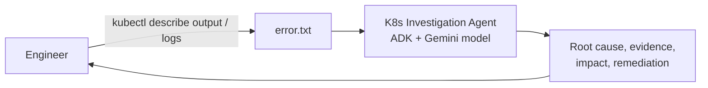
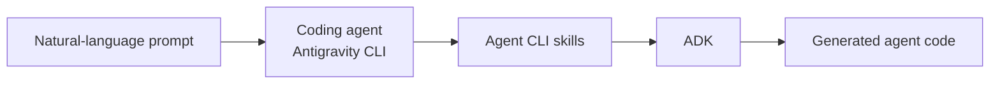
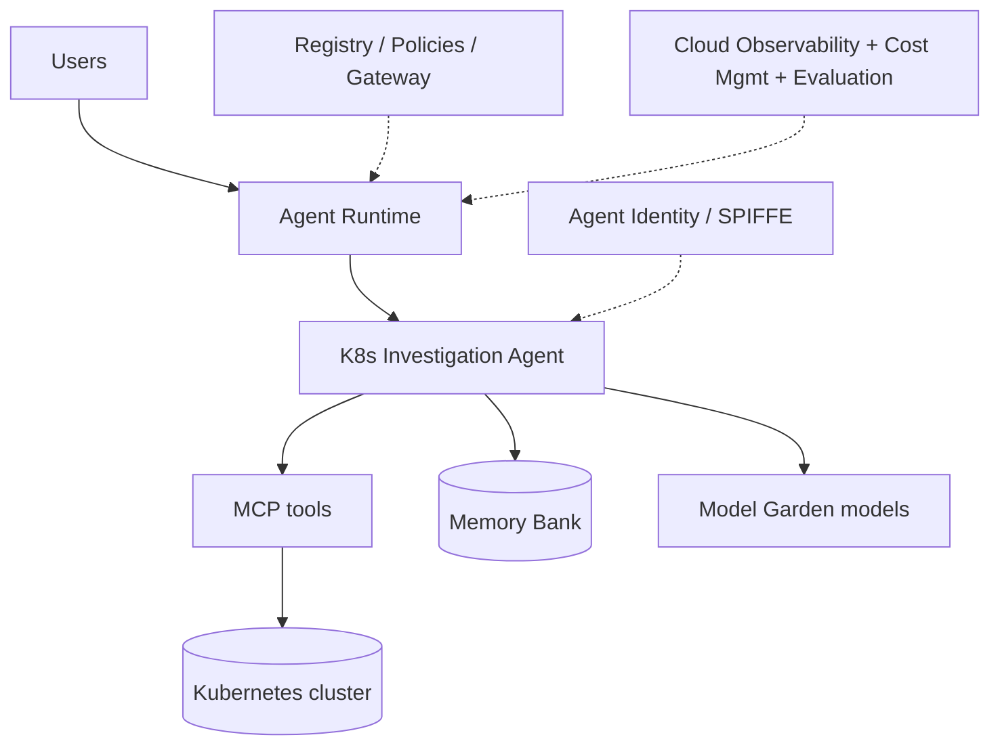

# Architecture

## v1 (Day 2): log-based investigation

```mermaid
flowchart LR
    U[Engineer] -->|kubectl describe output / logs| F[error.txt]
    F --> A[K8s Investigation Agent<br/>ADK + Gemini model]
    A --> R[Root cause, evidence,<br/>impact, remediation]
    R --> U
```

## Build-time tooling

```mermaid
flowchart LR
    P[Natural-language prompt] --> C[Coding agent<br/>Antigravity CLI]
    C --> S[Agent CLI skills]
    S --> K[ADK]
    K --> G[Generated agent code]
```

## Target architecture (end of series)

```mermaid
flowchart TB
    U[Users] --> RT[Agent Runtime]
    RT --> AG[K8s Investigation Agent]
    AG --> MCP[MCP tools] --> K8S[(Kubernetes cluster)]
    AG --> MB[(Memory Bank)]
    AG --> MG[Model Garden models]
    ID[Agent Identity / SPIFFE] -.-> AG
    GOV[Registry / Policies / Gateway] -.-> RT
    OBS[Cloud Observability + Cost Mgmt + Evaluation] -.-> RT
```
